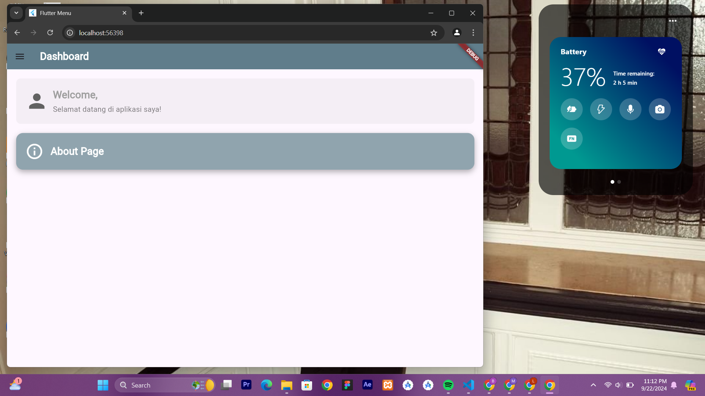
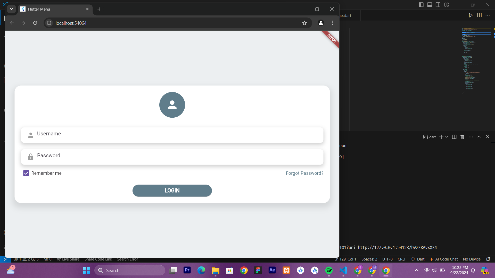
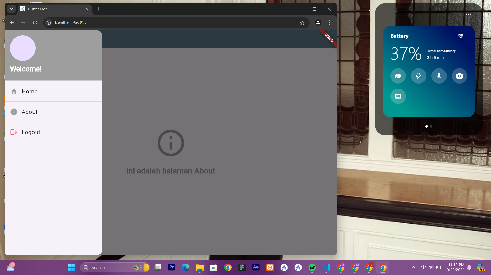
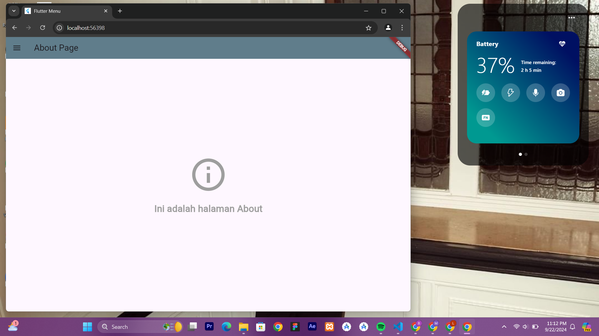

1. main.dart:
Fungsi main(): Memulai aplikasi dengan menjalankan widget MainApp.
MainApp: Merupakan StatelessWidget yang membungkus aplikasi dalam widget MaterialApp. Halaman awal aplikasi diatur ke Loginpage().
2. loginpage.dart:
Loginpage: Halaman login yang menggunakan StatefulWidget.
State Management: Menggunakan dua controller, _usernameController dan _passwordController, untuk menangani input dari user.
Fungsi _saveUsername(): Menyimpan username yang diinput ke dalam SharedPreferences untuk diakses nanti di halaman lain.
Widget _showInput(): Digunakan untuk membuat input field (TextField) yang dapat digunakan untuk username dan password.
Parameter controller digunakan untuk menghubungkan TextField dengan controller tertentu.
isPassword menentukan apakah input harus disembunyikan (seperti untuk password).
Tombol Login: Saat ditekan, tombol akan menjalankan dua fungsi:
Menyimpan Username: Menggunakan _saveUsername().
Navigasi ke Homepage: Menggunakan _showDialog() yang menampilkan pesan login berhasil dan kemudian mengarahkan ke halaman Homepage.
3. homepage.dart:
Homepage: Halaman beranda yang ditampilkan setelah login berhasil.
Fungsi _loadUsername(): Mengambil username dari SharedPreferences yang telah disimpan saat login dan menampilkannya dalam pesan "Welcome, {username}".
Section Welcome: Menampilkan pesan selamat datang kepada pengguna, dengan nama pengguna yang diambil dari SharedPreferences.
Tombol About Page: Saat tombol ini ditekan, pengguna diarahkan ke halaman AboutPage.
4. sidemenu.dart:
Sidemenu (Drawer): Sebuah navigasi samping yang bisa dibuka dari Homepage atau AboutPage.
Menu Items: Terdapat tiga menu utama:
Home: Navigasi ke halaman Homepage.
About: Navigasi ke halaman AboutPage.
Logout: Mengimplementasikan logika untuk keluar dari aplikasi (masih kosong di contoh kode ini).
5. about_page.dart:
About Page: Halaman sederhana yang menampilkan informasi "Ini adalah halaman About". Juga memiliki menu navigasi samping (Sidemenu) yang sama seperti di Homepage.
Drawer: Sama seperti di halaman lain, sidemenu ditambahkan di halaman ini untuk konsistensi navigasi.
Fitur Tambahan:
SharedPreferences: Digunakan untuk menyimpan data secara lokal, memungkinkan aplikasi menyimpan dan mengambil username yang digunakan setelah login.
Navigasi: Menggunakan Navigator.push() untuk berpindah antar halaman.

## Screenshot

